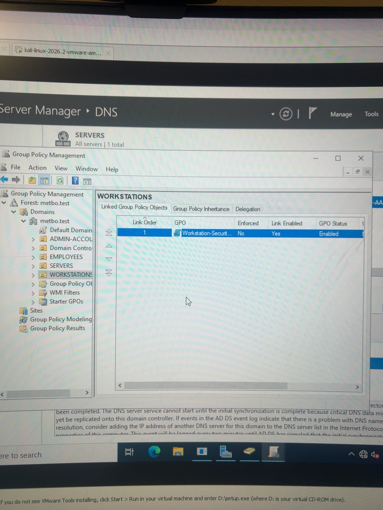
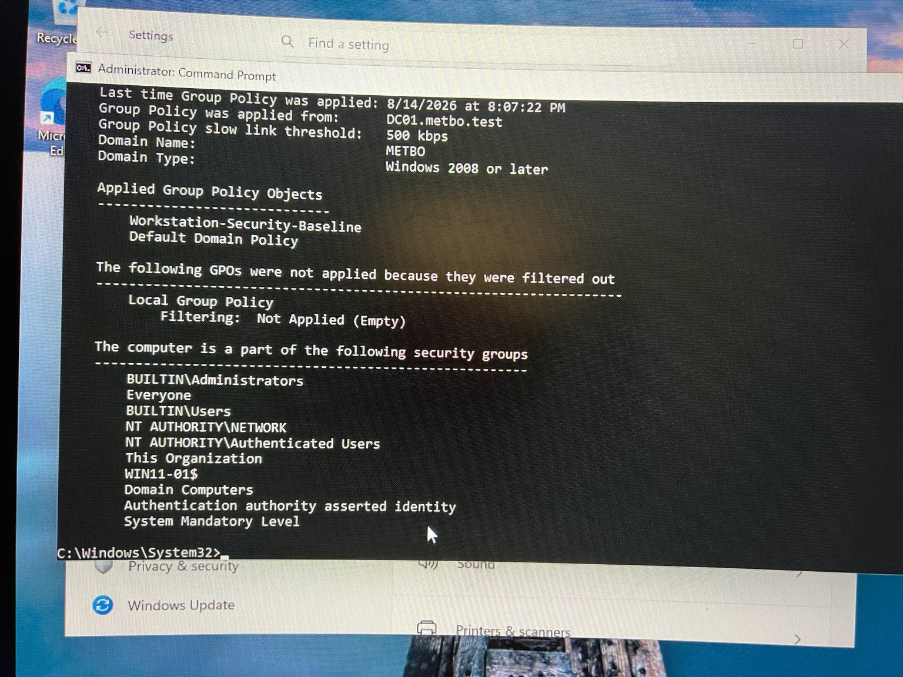
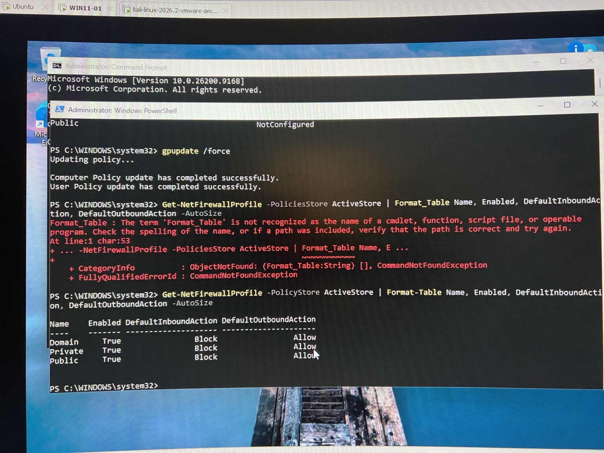
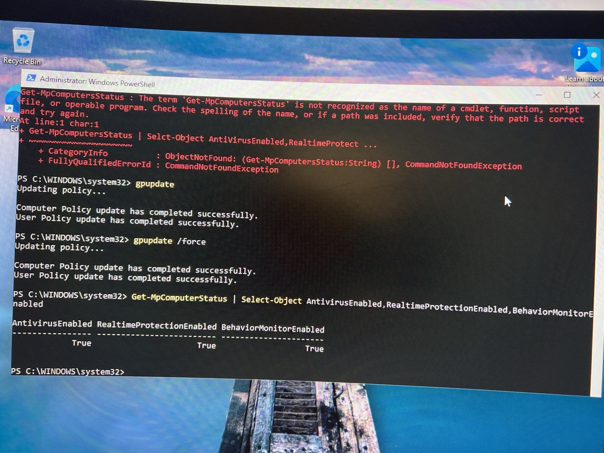
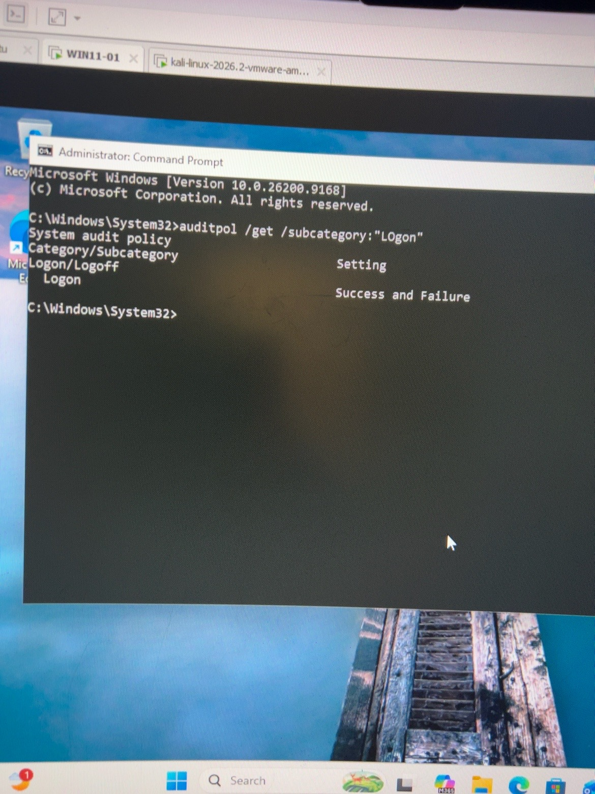
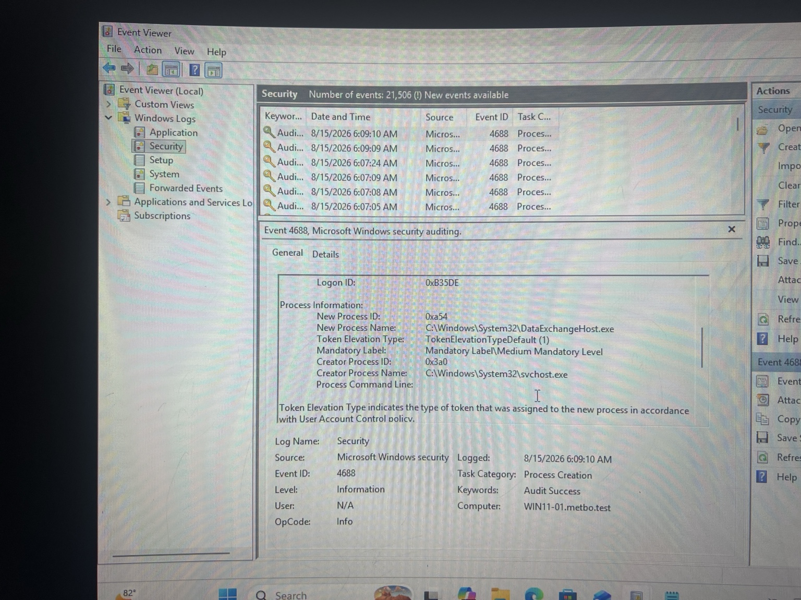

# Enterprise Active Directory Security Lab


## Project Overview

This repository documents an enterprise-style Active Directory and Windows endpoint security home lab built to develop practical skills in identity administration, Windows security, Group Policy, endpoint hardening, troubleshooting, and security-event analysis.

The environment was built in VMware Workstation using **Windows Server 2022**, **Windows 11 Pro**, **Kali Linux**, and **Ubuntu**.

**Phase 1 is complete** and focuses on Active Directory, endpoint hardening, Group Policy, and Windows security auditing.

> **Lab domain:** `metbo.test`  
> **Domain controller:** `DC01`  
> **Domain-joined workstation:** `WIN11-01`  
> **Lab network:** `192.168.200.0/24`

## Lab Architecture

```text
                         VMware Workstation
                     192.168.200.0/24 Lab Network

                                |
                +---------------+---------------+
                |                               |
         +-------------+                  +-------------+
         |    DC01     |                  |  WIN11-01   |
         | Server 2022 |                  | Windows 11  |
         +-------------+                  +-------------+
         | AD DS       |                  | Domain      |
         | DNS         |<---------------->| Workstation |
         | Group Policy|                  | Defender    |
         | metbo.test  |                  | Firewall    |
         +-------------+                  +-------------+
                |
                |             Phase 2 / Phase 3
                |        +---------------------------+
                +--------| Kali Linux / Ubuntu SIEM |
                         +---------------------------+
```

## Phase 1 — Active Directory & Endpoint Security

### Core Build

- Deployed **Windows Server 2022**
- Promoted `DC01` to a domain controller
- Installed and configured **Active Directory Domain Services (AD DS)**
- Installed and configured **DNS**
- Created the `metbo.test` Active Directory domain
- Configured server networking and validated connectivity
- Created organizational units for users, departments, workstations, servers, and administrative accounts
- Created users and security groups
- Practiced role-based access and delegated administration
- Deployed a **Windows 11 Pro** workstation
- Joined `WIN11-01` to `metbo.test`
- Verified domain authentication and DNS resolution

### Group Policy

Created and linked a **Workstation-Security-Baseline** GPO to centrally manage endpoint security.



Verified the workstation received the GPO from `DC01.metbo.test`.



### Windows Firewall Hardening

The effective firewall configuration was validated from `WIN11-01`.

```text
Profile    Enabled    Default Inbound    Default Outbound
Domain     True       Block              Allow
Private    True       Block              Allow
Public     True       Block              Allow
```



### Microsoft Defender

Microsoft Defender protections were verified with PowerShell.

```powershell
Get-MpComputerStatus |
Select-Object AntivirusEnabled,RealTimeProtectionEnabled,BehaviorMonitorEnabled
```

Verified:

```text
AntivirusEnabled             True
RealTimeProtectionEnabled    True
BehaviorMonitorEnabled       True
```



### Security Auditing

Advanced audit policy was configured through Group Policy.

Logon auditing was validated for both successful and failed authentication attempts.

```cmd
auditpol /get /subcategory:"Logon"
```



Process-creation auditing was also enabled and verified using **Windows Security Event ID 4688**.



The captured 4688 event demonstrates that Windows is recording process activity on the domain workstation, including the new process name and creator process.

## Troubleshooting Performed

A major part of this lab was troubleshooting instead of only completing configuration steps.

Issues investigated and resolved included:

- VMware virtual-network configuration
- Static IP, gateway, and DNS configuration
- Connectivity testing with `ping`
- DNS validation with `nslookup`
- Domain-join prerequisites
- Group Policy application with `gpupdate` and `gpresult`
- PowerShell syntax errors during firewall validation
- Standard-user restrictions on privileged audit-policy operations
- Security Event Log access restrictions
- Administrative elevation for protected security operations
- An audit configuration that initially returned **No Auditing**
- Final validation of Event ID 4688 in Event Viewer

## Security Concepts Demonstrated

- Active Directory administration
- Identity and access management
- Organizational Units and security groups
- Role-based access control
- Least privilege
- Domain authentication
- DNS
- Group Policy
- Endpoint hardening
- Windows Defender Antivirus
- Windows Defender Firewall
- Advanced Windows auditing
- Event Viewer investigation
- PowerShell
- Windows command-line administration
- Network troubleshooting
- VMware Workstation

## Useful Validation Commands

```cmd
ipconfig /all
ping 192.168.200.10
nslookup metbo.test
gpupdate /force
gpresult /r
auditpol /get /subcategory:"Logon"
auditpol /get /subcategory:"Process Creation"
```

```powershell
Get-NetFirewallProfile -PolicyStore ActiveStore |
Format-Table Name, Enabled, DefaultInboundAction, DefaultOutboundAction -AutoSize

Get-MpComputerStatus |
Select-Object AntivirusEnabled,RealTimeProtectionEnabled,BehaviorMonitorEnabled
```

## Project Roadmap

### Phase 1 — Active Directory & Windows Security ✅

Build the domain, deploy a Windows endpoint, apply centralized security controls, and validate Windows security logging.

### Phase 2 — Kali Linux Security Testing 🔜

Connect Kali Linux to the lab network, perform controlled discovery and security testing against lab-owned systems, and analyze the resulting activity.

### Phase 3 — Centralized SIEM / Detection 🔜

Use Ubuntu as a monitoring platform, centralize Windows logs, develop detections, investigate alerts, and document the SOC workflow.

## Ethics & Scope

This is a **personal cybersecurity home lab**. Any security testing documented in this repository is performed only against systems owned and controlled within the isolated lab environment.

---

**Author:** Charles Erdain  
**Focus:** Cybersecurity | SOC / Blue Team | Active Directory | Windows Security
